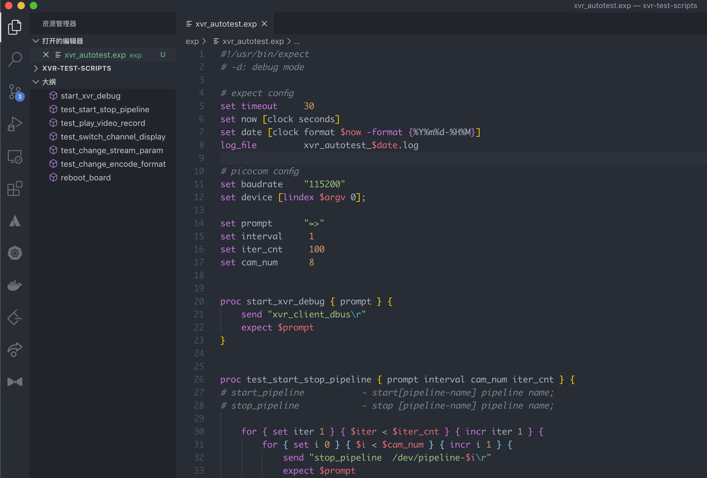

# Expect Outline

An extension for VS Code which provides support showing the outline for Expect scripts.

**Features:**

- outline view: support `set` `proc` keyword.

- syntax highlight
- code snippet

>The systax highlighting & code snippet code thanks for @bdavs
>
>Respect~